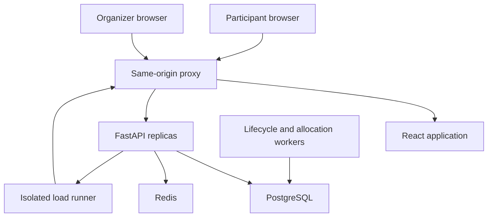

# FairDrop — Application Architecture

Build pack: FairDrop merged specification v1.0 · 2026-10-03.
Status: specification only; no code, benchmark, completed phase or human review is claimed.
Status: proposed design. Ownership and verification are defined in rules.md.

## 1. Stack and topology
Frontend: React/TypeScript/Vite, React Router, TanStack Query, Tailwind, Radix accessible primitives, Lucide, React Hook Form/Zod, Recharts for measured organizer charts.
Backend: Python/FastAPI/Pydantic, SQLAlchemy/Alembic/psycopg, PostgreSQL, redis-py, cryptography for seed-at-rest protection.
Verification: pytest/httpx, Playwright, k6.
Execution: Docker Compose, Nginx same-origin proxy, two API replicas for concurrency/limiter tests, one or more worker processes with database coordination.

Choose compatible stable releases at bootstrap, verify official APIs, pin dependencies and commit locks. A version is not considered installed until the coding environment verifies it.

Frontend / and API /api share an origin. The backend handles sessions, CSRF, ownership and domain rules. PostgreSQL owns durable state. Redis owns ephemeral shared limits/cache. No browser client allocates seats.



The API-to-runner connection exists only for authenticated lab orchestration in the demo profile. The runner's generated workload uses the normal public/session API, not private allocation shortcuts.

## 2. Repository layout
This pack contains six active specification files and `memory.template.md`. Put them at the repository root. Copy the template to `memory.md` only when the first implementation edit begins. An existing repository's AGENTS.md may point to rules.md; do not preserve conflicting old instructions. The canonical wire contract is the Shared API contract section below; a separate api-contract.md is not required.

An operational README.md is generated during coding by P4 with commands that have actually been verified. Generated contracts and progress records are implementation artifacts, not additional competing specifications.

| Path | Contents | Owner |
| --- | --- | --- |
| backend/app/core/ | Configuration, errors, clock, shared interfaces | P1 |
| backend/app/persistence/ | Shared ORM models/repositories | P1 |
| backend/app/drops/ | Public/admin drops, entries/history | P1 |
| backend/app/allocation/ | Draw, reservations, promotion, lifecycle worker | P1 |
| backend/app/audit/ | Receipts, proof bundle, audit | P1 |
| backend/app/security/ | Credential auth, sessions, role/ownership helpers, limits, profile | P2 |
| backend/app/lab/ | Allowlisted run routes/orchestration/reports | P4 |
| backend/app/main.py | Fixed router wiring | P1 |
| backend/alembic/ | All migrations | P1 |
| backend/tests/core/ | Domain/concurrency tests | P1 |
| backend/tests/security/ | Session/abuse tests | P2 |
| frontend/src/app/ | App shell/router/providers | P3 |
| frontend/src/components/ | Shared design components | P3 |
| frontend/src/features/ | Public, participant, organizer, lab, proof views | P3 |
| frontend/src/lib/api/ | Generated types and typed client | P3 |
| contracts/ | Exported OpenAPI, examples, version | P1 |
| tests/performance/ | k6 scenarios and report analysis | P4 |
| tests/e2e/ | Browser journeys | P4 |
| scripts/, infra/, compose.yaml | Seed/run/proxy/deployment tools | P4 |
| progress/person-N.md | Active task and evidence once coding starts | Corresponding person |
| memory.md | Active progress from first code edit; P1 until bootstrap, then P4 | P1 -> P4 |

P1 initially creates interface/model/router skeletons across modules. After checkpoint, each owner exclusively edits their area. API/database changes go through P1. Frontend dependencies go through P3; infrastructure through P4.

## 3. Data model
| Record | Important fields/rules |
| --- | --- |
| User | UUID, random public ID, display_name, timezone, role; role immutable through participant profile API |
| AccessCredential | Keyed digest, user_id, issued/expiry/revocation times; secret issued only through provisioning |
| EligibilityGrant | drop_id + user_id unique; qualifying credential/invitation provenance; not generated freely by participants |
| Session | Opaque token digest, user_id, CSRF secret, expiry, revocation; durable |
| Drop | owner_id, title, description, category, location, capacity, mode, phase, timing, rule version, commitments |
| Entry | drop_id + user_id unique; public ID, joined_at, qualifying grant, receipt ID; status/rank projected |
| SeatSlot | drop_id + slot number unique; immutable slot identity; exactly capacity rows |
| Reservation | drop/user/entry/slot, OFFERED/CONFIRMED/EXPIRED, deadline and transition timestamps |
| DrawRun | drop_id unique, frozen manifest/commitment, encrypted-or-protected seed, algorithm version, checkpoint |
| AuditEvent | Transition/object/actor/public-safe reason; no raw credentials |
| IdempotencyOperation | user+concrete method/path+key unique, request fingerprint, durable result reference, operation status |
| LabRun | Allowlisted config, progress, status, artifact paths, errors; demo-only record namespace |

Reservation is the authoritative ownership relation. SeatSlot contains immutable identity/drop/slot number; do not also maintain a competing owner pointer or Redis inventory counter. A partial unique index on `(drop_id, seat_slot_id)` where status is OFFERED or CONFIRMED gives at most one current owner per slot. A matching partial unique index on `(drop_id, user_id)` gives at most one current seat per account. Use composite foreign keys to ensure reservation, entry, user and slot belong to the same drop; plain independent UUID foreign keys are insufficient for that invariant. Historical EXPIRED reservations remain for audit.

Add FrozenEntry(draw_id, entry_id, public_entry_id) and DrawRank(draw_id, entry_id, rank, score_bytes) durable relations. FrozenEntry has unique membership per draw; DrawRank has unique `(draw_id, entry_id)` and `(draw_id, rank)`. Snapshot and complete published ranks are immutable. DrawRun stores the next unoffered rank cursor. Entry status is a read projection of entry/cancellation, published ranking and reservation history; do not independently update a second seat-status authority.

Create exactly capacity SeatSlot rows atomically at publication; capacity then locks. `capacity > 0`, positive slot numbers, foreign keys and unique indexes are database constraints. The creation service and migration tests establish the capacity-row count; a simple row CHECK cannot compare a count across a table. Derive offered/confirmed/free counts from these records.

A user's durable credential authenticates them. EligibilityGrant decides whether they can enter a particular drop. Multiple devices using that same user still yield one entry. Organizer/admin users are separately provisioned and cannot grant themselves permissions through profile updates. Grant membership locks at publication. Entry acceptance records the qualifying grant; later session or credential revocation prevents future access but does not silently remove an already accepted entry or change its odds. Whole-drop cancellation is the supported pre-allocation safety action in this version.

## 4. Domain state
Drop: DRAFT -> SCHEDULED -> OPEN -> CLOSED -> DRAWING -> OFFERING -> COMPLETED.
Cancellation: DRAFT/SCHEDULED/OPEN -> CANCELLED, before any draw/offer starts. Cancellation from later phases is not supported in this version.
Entry: ENTERED -> OFFERED or WAITLISTED; WAITLISTED -> OFFERED; OFFERED -> CONFIRMED or EXPIRED; ENTERED -> CANCELLED when its drop is cancelled.
Reservation: OFFERED -> CONFIRMED or EXPIRED. No revival.
DrawRun: FROZEN -> COMPUTING -> PUBLISHED; recoverable failure keeps the same run/seed/list.

COMPLETED means no more seat changes are possible: either all slots are CONFIRMED, or the rank list is exhausted and no OFFERED reservation remains. An empty draw completes with zero offers. An undersubscribed drop offers every accepted entry and may complete below capacity. Expired entrants are not offered again; leftover WAITLISTED entries at full completion receive a clear final "No further offers" message.

Public phase transitions use the database clock. A lifecycle worker opens scheduled drops at starts_at and closes them at ends_at. An API request that reaches a stale OPEN phase after ends_at must still reject new entry by clock checks. Workers reconcile incomplete durable work periodically. Cancellation also checks that no draw or reservation exists; this prevents cancelling an OPEN FCFS_DEMO drop that already made offers.

Publication locks capacity, eligibility policy, draw mode and all deadlines. Published content can be edited descriptively with audit. State commands are idempotent and role/owner guarded.

## 5. Atomic entry and closure
Begin an entry transaction, acquire a shared row lock on the drop, read `clock_timestamp()` after locking, check OPEN and deadline, validate the publication-locked eligibility grant, insert-or-return the existing unique entry, write receipt/audit/idempotency state, then commit. Concurrent entry transactions may hold compatible shared locks. Use READ COMMITTED for this design and keep entry transactions short. Do not upgrade the drop row to an exclusive lock to increment counters: compatible-lock upgrades can deadlock and serialize admissions. Use derived counts. After waiting for entry locks, closure uses a new statement snapshot to include their commits. New-request deadline is `starts_at <= clock_timestamp() < ends_at`; at equality with ends_at, reject. Previously accepted entries may still be returned after closing.

Closure acquires the exclusive row lock on the same drop. It waits for in-flight accepted entry transactions, rechecks the DB deadline/state, sets CLOSED and materializes a canonical snapshot of all committed accepted entries inside the transaction. New entry requests must then observe CLOSED. Eligibility modifications are coordinated through the same transition guard; freeze cannot race with silent eligibility changes.

If PostgreSQL isolation makes the exact SQLAlchemy pattern behave differently, prove the final equivalent with the entry-versus-close integration test. Do not merely assume the lock name makes the logic correct.

## 6. Draw and reservations
Generate a cryptographically random seed before publication; publish SHA-256 commitment then. Keep it server-private through entry acceptance. Canonical list uses random public entry IDs with fixed encoding; freeze and commit it at closure.

After freeze compute HMAC-SHA256(seed, domain-separated drop ID + public entry ID) once per entry. Store raw 32-byte scores; sort ascending, breaking ties lexicographically by public ID. Runtime is O(N log N), storage O(N); 50k ranks is a bounded batch, not a transaction for every external request.

Record one DrawRun per drop. Use database row/advisory coordination, unique run constraints and resumable checkpoints. Concurrent or repeated triggers reuse it. Ranking and participant snapshot become immutable. Publish all ranks only after complete computation.

Reserve at most capacity entries, in bounded transactions, with authoritative slot locks and uniqueness. Nobody may skip a higher-priority unoffered entry because a worker restarted. Use a per-drop durable promotion cursor/coordinator and idempotent writes; callers never choose a favourable position.

Reservations have expiry based on DB time. All allocation mutations lock in this order: Drop FOR UPDATE, SeatSlot FOR UPDATE, Reservation FOR UPDATE, then affected entry/rank records in ascending ID order where needed. The single per-drop coordinator favors clarity at the 500-seat scale; entry admission alone uses compatible shared drop locks before closure. Resolve an offer's slot first without taking conflicting locks, then acquire this order and recheck the record. Confirmation and expiry/promotion use this order, then use a fresh `clock_timestamp()` (not transaction-start `now()`/`CURRENT_TIMESTAMP`) to check expiry. Exactly one operation wins. Confirmation never performs network I/O while holding these locks. Promotions follow persisted rank; each entry is offered at most once. Recovery scans unfinished draws and expired active offers.

An exhausted list can complete below capacity. Never re-offer an expired entrant by default or claim the system sold every seat without confirmations.

## 7. Reliable request/session flow
Cookie is an opaque session token; database stores a digest. HttpOnly/SameSite, Secure under TLS. Authenticated writes require Origin checks and X-CSRF-Token. GET /auth/me returns a per-session CSRF token; CORS is same-origin in normal deployment.

Idempotency-Key identifies one retriable mutation, scoped to principal and route, and tied to payload fingerprint. Domain uniqueness also holds for different keys. Store a durable domain result reference; replay may resolve the current state of that same object. Clients reconcile /me after uncertainty. An IdempotencyOperation row is claimed atomically within the domain transaction. Conflicting same-key requests wait or get an explicit retriable response; they never both execute. Rollback releases an uncommitted claim. Keep fingerprint/result references, not raw credentials. Do not persist secret-bearing session-create responses in generic idempotency tables.

Reconnect -> fetch session -> fetch own state -> display committed result. Client clocks, localStorage and countdowns are not authorities.

## 8. Abuse and failure policy
Redis atomic token buckets/sliding windows by authenticated identity, session, endpoint and coarse network key. Untrusted X-Forwarded-For cannot override proxy-derived source. Multiple API replicas share state. Network heuristics may throttle ingress but never weigh draw scores.

Redis failure: readiness reports degradation; safe authorized reads continue if DB is healthy; new auth/entry/confirmation abuse-sensitive writes return retryable 503 under the documented bounded policy. This can cost admission or confirmation opportunity, so report that availability limitation. Do not promise that accepted sessions solve every outage.

PostgreSQL unavailable: no claimed successful mutation or authoritative private state. Proxy/API process crash: persisted state survives. Worker crash: reconcile durable checkpoints. Entire host/storage loss: require backup and restore; beyond process restart evidence.

Global overload limits bound work and queues; return explicit retryable failure instead of unbounded wait. Differentiate expected 429 responses and unexpected 5xx.

## 9. Proof and privacy
Public proof has algorithm/rules version, pseudonymous frozen IDs, scores/ranks, commitments and revealed seed. Never include private names, email/contact data, session material or invitation codes. Receipt verification checks the participant's public ID inclusion.

This proves reproducibility against the published commitments, not immunity to organizer seed-search or selective cancellation. Independent future randomness after manifest commitment is a later strengthening and must define outage/abort policy.

## 10. Lab and comparison
Lab routes use organizer dependency plus isolated-demo enablement. Runner accepts only fixed target configuration, named scripts and bounded numbers. Use subprocess argv without shell interpolation, caps, cancellation and report persistence. Ground truth stays in harness files. Provisioning is excluded from measured entry load unless a scenario explicitly measures it.

Safe FCFS comparator is demo-only: same invitation, uniqueness, limits, inventory and confirmation, but admission order sets offers/waitlist. LOTTERY holds compatible shared entry locks; FCFS_DEMO instead takes the exclusive drop lock to assign an atomic admission sequence and immediate offers, retaining uniqueness and all deadline guards. After a slot expires it promotes the earliest unoffered admitted entry, or leaves it free until another admission/worker reconciliation. At deadline it freezes/publishes admission-order proof; it never invokes random ranking. It records a per-drop admission sequence transactionally; its serialized ordering cost is reported as part of that policy, not disguised as identical internal processing. FCFS publishes admission-order proof without an HMAC seed/score; it never pretends a random draw occurred. It is disabled in normal deployments. Historical naive no-defence runs remain separately labelled. Experimental /24 weighting or suspicion demotion is offline/isolated and never silently activated in the default service.

## 11. Integrations
P2 exposes security.router, get_principal(request), require_organizer(request), require_drop_access(principal, drop_id), enforce_limit(request, principal, action), and a seeded credential provisioning utility.
P1 mounts these fixed imports plus lab.router, supplies complete models, exports contracts and supplies allocation-worker entrypoint.
P3 generates TypeScript from OpenAPI and adds no backend business logic.
P4 calls the real API and runs the worker/seed tooling; it does not directly insert wins during measured requests.

## 12. Shared API contract (normative)
Version: v1.0 proposed wire contract. P1 encodes this section into complete OpenAPI at bootstrap. All four members use these exact paths; frontend /organizer routes intentionally call API /admin routes. Coordinate changes through P1 and affected consumers.

### 1. General rules
Base /api/v1. Same-origin browser cookies. UTC ISO-8601 timestamps ending Z. UUID internal IDs and high-entropy random public IDs. snake_case JSON. Paginate lists with {items,next_cursor}; cursor is opaque. Maximum default page size 50, absolute maximum 100. Response time comes from server_time. Private responses are no-store; caches may contain only explicitly public drop metadata.

Error shape:
```json
{"error":{"code":"STABLE_CODE","message":"Safe explanation","request_id":"uuid","retryable":false,"fields":null}}
```
fields is null or a string-to-array-of-messages validation map. Request ID is also an X-Request-ID header. Status conventions and named codes are in rules.md. No secrets in errors.

All domain POST/PATCH mutations except session establishment use Idempotency-Key (UUID) and X-CSRF-Token with Origin validation. Eligibility DELETE also requires Idempotency-Key, CSRF and Origin; an authorized repeat removal of the same grant returns 204. DELETE /auth/session requires CSRF/Origin; it may safely return 204 when the already-revoked session is retried. Session POST has strict Origin validation and authentication-endpoint limits before a session exists. Browser cookies are opaque; test clients follow the same CSRF flow.

Idempotency binds principal+HTTP method+concrete path+key+payload fingerprint. Repeated domain operation resolves the same object; current object state may have progressed. Different payload with same key -> 409 IDEMPOTENCY_CONFLICT. Different keys cannot circumvent unique entries/ownership. Generic operation storage never persists Set-Cookie/token responses.

### 2. Reusable types
Principal: {id, public_id, role:participant|organizer|admin, display_name, timezone}.
No public eligibility_id is needed: eligibility is per-drop through EligibilityGrant.
SessionResponse: {principal, csrf_token, expires_at, server_time}.
PublicOrganizer: {public_id, display_name}; no private contact/credentials.

DropSummary: {id,title,category,organizer,location_type:online|venue,location_label,starts_at,ends_at,capacity,phase,mode}.
DropDetail extends summary with {description,confirmation_seconds,rules_version,eligibility_policy:invitation,seed_commitment:null|string,server_time,cancellation_reason:null|string}. The seed commitment is null before LOTTERY publication and for FCFS_DEMO.
Description is plain text initially, safely rendered. No untrusted raw HTML.
DropPhase: DRAFT,SCHEDULED,OPEN,CLOSED,DRAWING,OFFERING,COMPLETED,CANCELLED.
AllocationMode: LOTTERY or FCFS_DEMO. Only LOTTERY in normal profile.

Reservation: {id,seat_slot_id,status:OFFERED|CONFIRMED|EXPIRED,expires_at,confirmed_at:null|timestamp}.
EntryState: {entry_id,public_entry_id,drop_id,status:ENTERED|WAITLISTED|OFFERED|CONFIRMED|EXPIRED|CANCELLED,joined_at,receipt_id,draw_id:null|uuid,rank:null|integer,reservation:null|Reservation,server_time}.
Rank is 1-based and null before publication. No withdrawn state in this version.

MyDropState: {entry:null|EntryState,eligibility:{eligible:boolean,reason:null|INVITATION_REQUIRED|REVOKED},server_time}.
Receipt: {entry:EntryState,drop:DropSummary,rules_version,proof_url}.
InventoryMetrics: {drop_id,capacity,entered_count,eligible_count,active_reservations,confirmed_seats,free_seats,expired_reservations,duplicate_active_owners,integrity_ok,server_time}.
entered_count is unique accepted entry records including subsequently cancelled entries; eligible_count is the frozen eligible count after freeze, or currently qualifying accepted entries before freeze. free_seats = capacity - active_reservations - confirmed_seats.

AuditRecord: {id,event_type,object_type,object_id,actor_public_id:null|string,reason:null|string,created_at}. No raw credential/session.
DrawStatus: {draw_id,drop_id,status:FROZEN|COMPUTING|PUBLISHED,processed_entries,total_entries,recoverable_error:null|string,server_time}.
A recoverable error does not create a new seed or draw ID.

### 3. Authentication and profile — P2
| Method/path | Body/query | Result/behaviour |
| --- | --- | --- |
| POST /auth/session | {access_code} | 200 SessionResponse + cookie; repeat login may create another session for same principal |
| GET /auth/me | none | 200 SessionResponse; invalid session 401 |
| DELETE /auth/session | CSRF | 204 revocation + clear cookie |
| PATCH /profile | {display_name?,timezone?} | 200 {principal,server_time}; reject role/owner/grant fields |

Access-code login does not itself issue a new user or eligibility grant. Credential provisioning is restricted script/admin setup. timezone must be a supported IANA timezone, not a raw UTC offset. Safe limits on display_name length. Participant grants are visible only through their own drop state.

### 4. Public and participant routes — P1
| Method/path | Body/query | Result |
| --- | --- | --- |
| GET /drops | q,category,phase,cursor,limit | Public list; excludes private DRAFT |
| GET /drops/{drop_id} | none | DropDetail; unknown/private unauthorized 404 |
| POST /drops/{drop_id}/entries | {} | 201 new EntryState, 200 existing EntryState |
| GET /drops/{drop_id}/me | session | MyDropState |
| GET /entries | session,cursor,limit | Own receipts/history, paginated |
| GET /entries/{entry_id} | session | Own Receipt; another account returns 404 |
| POST /reservations/{reservation_id}/confirm | {} | 200 current EntryState on valid confirmation/replay |
| GET /drops/{drop_id}/proof | none | pending or published ProofResponse |

New entry requires active grant, OPEN and fresh DB now < ends_at. Before starts_at -> 409 ENTRY_NOT_OPEN; at/after ends_at -> 409 ENTRY_CLOSED. An already committed entry can still be retrieved/replayed after closing; it does not create a late entry. If no grant -> 403 INVITATION_REQUIRED. A banned session cannot receive another user's existing receipt.

Confirmation requires ownership, OFFERED and fresh DB now < expires_at after locking. Expired -> 409 OFFER_EXPIRED. Confirmed same reservation -> 200 same confirmed result. An unrelated reservation -> 404 to avoid object enumeration.

### 5. Organizer routes — P1 except specified security checks
require_organizer plus drop owner/admin authorization on every owned resource.
| Method/path | Payload/query | Result |
| --- | --- | --- |
| GET /admin/drops | cursor,limit | Owned DropSummary list (admin all) |
| POST /admin/drops | DraftInput | 201 DropDetail |
| PATCH /admin/drops/{drop_id} | DraftPatch or permitted description fields | 200 DropDetail |
| POST /admin/drops/{drop_id}/publish | {} | SCHEDULED DropDetail; lock rules/commit seed |
| POST /admin/drops/{drop_id}/open | {} | OPEN if due; idempotent; worker can do same |
| POST /admin/drops/{drop_id}/close | {} | CLOSED if due; reuse snapshot |
| POST /admin/drops/{drop_id}/draw | {} | 202 DrawStatus or existing published status |
| GET /admin/drops/{drop_id}/draw | none | DrawStatus or explicit not-created |
| POST /admin/drops/{drop_id}/cancel | {reason} | CANCELLED; only DRAFT/SCHEDULED/OPEN and no draw/reservations |
| GET /admin/drops/{drop_id}/metrics | none | InventoryMetrics |
| GET /admin/drops/{drop_id}/audit | cursor,limit | Paginated AuditRecord |
| GET /admin/drops/{drop_id}/entries | cursor,limit | Pseudonymous entry states; no credentials |
| GET /admin/drops/{drop_id}/entries/export | none | CSV of pseudonymous entry/status/rank |
| POST /admin/drops/{drop_id}/eligibility | {user_public_ids:[...]} | Grant operation summary; DRAFT only |
| DELETE /admin/drops/{drop_id}/eligibility/{user_public_id} | none | 204; DRAFT only |

Eligibility management is owned by P1 using P2 authorization and pre-existing provisioned accounts. Batch limits apply. Publication locks grant membership to avoid arbitrary post-publication additions/revocations in this version. An accepted entry records its qualifying grant. Later session/credential revocation denies access but does not invalidate that already accepted entry or silently change its ranking. Whole-drop cancellation is a separate pre-allocation safety control; selective post-entry disqualification is outside v1.

DraftInput: {title,description,category,location_type,location_label,capacity,starts_at,ends_at,confirmation_seconds,mode:LOTTERY}.
Demo-only creation permits FCFS_DEMO under lab profile. DraftPatch uses the same editable fields; post-publication permits title/description/location_label only. Do not pretend title changes allow rule/time changes. starts_at < ends_at and positive bounded capacity/confirmation. Publish requires future start and complete fields. Open cannot precede start; close cannot precede deadline. Auto lifecycle transitions use these same guards.

### 6. ProofResponse
Pending: {status:pending,phase,seed_commitment,manifest_commitment:null|string,server_time}.
Published:
{status:published,drop_id,draw_id,algorithm_version,rules_version,mode,seed:null|string,seed_commitment:null|string,manifest_commitment,entries:[{public_entry_id,score_hex:null|string,rank}],server_time}.
Seed and scores exist only for LOTTERY; FCFS_DEMO uses algorithm_version=fcfs-admission-v1, null seed/commitment/scores, and explicitly declares admission-order mode rather than pretending HMAC determined its order.

Canonical encoding selected at bootstrap:
- UTF-8 public_entry_id strings generated by server, UUID drop_id lower-case textual form.
- Score message bytes: UTF-8("fair-drop:v1:" + drop_id + ":" + public_entry_id).
- Seed: 32 raw bytes; published as 64-character lower-case hex; commitment SHA-256(raw seed).
- Manifest: lexicographically sorted public_entry_id strings, each UTF-8 with a single LF, including final LF; empty manifest is empty bytes.
- Manifest commitment SHA-256(manifest bytes).
- Sort raw 32-byte HMAC scores ascending then public ID ascending; rank starts at 1.
Publish the same algorithm version in backend, client verifier and reports. Independent future randomness is not in v1.

Proof may be a moderately sized payload at 50k entries; cap permitted population and support compressed delivery/download. Verifier does bounded local processing, offers accessible status and avoids blocking navigation.

### 7. Lab — P4
All under /admin/lab and require organizer/session/CSRF plus isolated-demo flag.
RunRequest:
{scenario:normal|early_bot|retry_flood|credential_farm|shared_ip|reconnect|worker_restart|expiry_race|redis_failure|policy_compare,
human_actors:integer,bot_actors:integer,duration_seconds:integer,target_rps:number,retries_per_actor:integer,trials:integer,drop_capacity:integer}
All caps come from server profile. User cannot set target_url, arbitrary script, arbitrary command, trusted IP header or public seed.

POST /admin/lab/runs -> 202 {run_id,status:QUEUED,server_time}.
GET /admin/lab/runs -> paginated RunSummary.
GET /admin/lab/runs/{run_id} -> RunDetail.
POST /admin/lab/runs/{run_id}/stop {} -> {run_id,status,server_time}.
GET /admin/lab/runs/{run_id}/report -> measured report or explicit pending state.
GET /admin/lab/runs/{run_id}/export -> bounded JSON report download.

RunStatus: QUEUED,RUNNING,STOPPING,STOPPED,COMPLETED,FAILED.
RunDetail: {run_id,status,scenario,config,progress:{completed_steps,total_steps,message},started_at:null|timestamp,ended_at:null|timestamp,error:null|safe_error,report:null|RunReport,server_time}.

RunReport:
- provenance: source=measured|supplied_unreproduced, timestamp, contract/algorithm/app commit, environment/hardware.
- workload: provisioned_identity_count, actors_by_cohort, request_rate_target, scheduled_iterations, delivered_iterations, dropped_iterations, achieved_rps, peak_open_connections, peak_inflight_requests, generator_cpu_peak,generator_memory_peak.
- admission: attempted_unique_identities and accepted_unique_identities per cohort; admission_rate.
- allocation: eligible_identities, initial_offers, confirmed, expired, actor_credentials, win_rate per cohort, bot_advantage:null|number with undefined_reason.
- integrity: capacity, maximum_observed_owned_slots, duplicate_active_owners, oversell_count, audit_pass.
- performance: successful_request latency p50/p95/p99 milliseconds; separate endpoint/status breakdown, expected_429/403/409, unexpected_5xx, network_errors.
- statistics: trials, sample_sizes, interval_method:null|string, intervals:null|data.
- limitations: list; stopping/partial runs cannot masquerade as complete trials.
No raw credentials/cookies/seed-before-reveal in artifacts.

Organizer global latency is not inferred from database entry timestamps. Until measured instrumentation exists, mark unavailable. Reports contain real request measurements.

### 8. Deployment
GET /api/health/live -> process alive.
GET /api/health/ready -> ready/degraded dependencies and safe capability flags; no secrets.
Degraded Redis response must not cause proxy to incorrectly discard all safe read traffic; P4/P2 agree routing/readiness policy. DB outage returns unavailable. Normal profile disables lab, seed fixtures, FCFS_DEMO and development mock selection.

### 9. Bootstrap outputs
P1 commits contracts/openapi.json, schema-version file, fixtures for every significant participant/error/lab state, and a single type-generation command. P3 consumes generated output at frontend/src/lib/api/generated.ts. P2/P4 validate their actual responses against those schemas. Full examples include scheduled/entered/waitlisted/offered/confirmed/expired/cancelled plus 401/403/409/429/503 and running/completed/failed lab.

Schemas must be real complete request/response models rather than undocumented dictionaries. Stub endpoints return explicit NOT_IMPLEMENTED; they are never claimed complete in memory or shown as real metrics.

## 13. Operational baseline and bounds

These are initial configuration limits, not measured capacity claims. P4/P2 may tune them with evidence and update the contract fixtures together.

| Setting | Initial specification |
| --- | --- |
| Profiles | normal, demo, test; fail closed if invalid |
| Deployment services | frontend static build/proxy, api-a, api-b, worker, postgres, redis; demo adds runner |
| Population ceiling | 50,000 accepted entries per drop; reject overflow explicitly, report admission effects |
| Seat capacity ceiling | 500 for the hackathon configuration |
| Default list page | 50; maximum 100 |
| Eligibility batch | Maximum 500 existing account public IDs |
| Body size | 64 KiB for ordinary JSON; no arbitrary file uploads |
| Worker tick/batch | 1 second / at most 100 state changes per transaction |
| Polling | 10–20 seconds with jitter; short demo interval is separately configured |
| Lab job | One active job; at most 50,000 provisioned identities, 300 seconds/trial, 20 trials, 20 retries/actor |
| Lab target RPS | Default 100; max 2,000 until P4 records a reviewed higher cap; actual delivered rate always reported |
| Session | 24-hour absolute lifetime; current-session logout/revocation; no sliding-extension dependency |
| DB connections | Explicit per-process pools and overflow limits; sum API/worker/runner pools within DB budget |

Environment contract: APP_PROFILE, DATABASE_URL, REDIS_URL, PUBLIC_ORIGIN, SESSION_DIGEST_KEY, CREDENTIAL_DIGEST_KEY, SEED_ENCRYPTION_KEY, COOKIE_SECURE, LAB_TARGET_ORIGIN, LAB_MAX_RPS, LAB_MAX_IDENTITIES. Commit .env.example with placeholders only. P1/P2 agree authenticated seed encryption using `cryptography` AES-GCM and random nonce; no home-made encryption. Keep seed-protection keys stable across worker restarts. Keys/seed are never exposed before reveal. Normal profile requires TLS/Secure cookies, refuses default keys, ignores requests to enable FCFS/lab and disallows fixture seeding. Local demo documents its HTTP-cookie exception.

The worker never depends on Redis TTL notifications to expire offers. Each tick reconciles due lifecycle transitions, unpublished draws, missing initial offers, expired reservations and promotions from PostgreSQL. Ranking computation occurs outside a long ownership transaction, using the immutable snapshot and stored seed; publication is atomic only after all rank records validate. Offer creation, cursor advancement, audit and reservation ownership commit together. Worker interruption can cause delay, never a fresh draw.

P4 creates verified commands for locked installs, migrations, private demo provisioning, worker startup, API/OpenAPI export, frontend type generation, pytest, Playwright, k6 and demo reset. Do not invent working commands before these scripts exist. Use an explicit destructive-reset flag; the normal profile rejects reset/seed tooling. Keep PostgreSQL in a persistent volume and document backup/restore separately from restart tests.

## 14. Primary implementation references

Use these official sources when selecting installed versions and APIs. This document specifies decisions; it does not claim packages are installed.

- [PostgreSQL row locks](https://www.postgresql.org/docs/current/explicit-locking.html)
- [PostgreSQL constraints](https://www.postgresql.org/docs/current/ddl-constraints.html)
- [PostgreSQL date/time functions](https://www.postgresql.org/docs/current/functions-datetime.html): deadline checks use wall clock after locks.
- [FastAPI](https://fastapi.tiangolo.com/), [SQLAlchemy](https://docs.sqlalchemy.org/), [Alembic](https://alembic.sqlalchemy.org/)
- [React](https://react.dev/), [Vite](https://vite.dev/), [TanStack Query](https://tanstack.com/query/latest/docs/framework/react/overview)
- [Redis lock failure considerations](https://redis.io/docs/latest/develop/clients/patterns/distributed-locks/): a Redis lock is not inventory authority here.
- [k6 arrival-rate allocation](https://grafana.com/docs/k6/latest/using-k6/scenarios/concepts/arrival-rate-vu-allocation/)
- [OWASP bot management](https://cheatsheetseries.owasp.org/cheatsheets/Bot_Management_and_Anti-Automation_Cheat_Sheet.html)
- [OWASP CSRF prevention](https://cheatsheetseries.owasp.org/cheatsheets/Cross-Site_Request_Forgery_Prevention_Cheat_Sheet.html)

## 15. File structure to implement

These filenames define the intended module boundaries; they are not claimed to exist yet. Avoid copying a whole repository in every prompt.

| Path | Contents / owner |
| --- | --- |
| backend/app/main.py | App/routers/middleware entrypoint — P1 |
| backend/app/core/config.py, errors.py, clock.py, idempotency.py | Shared config, safe errors, wall-clock adapter, retriable operation service — P1 |
| backend/app/persistence/models.py, database.py | Single ORM metadata and transaction/session factory — P1 |
| backend/app/drops/router.py, service.py | Public/participant/owned organizer domain API — P1 |
| backend/app/allocation/draw.py, reservations.py, lifecycle.py, worker.py | Snapshot/ranking, ownership transitions and reconciler — P1 |
| backend/app/audit/router.py, service.py, verifier.py | Public proof, safe audit, independent verifier — P1 |
| backend/app/security/router.py, sessions.py, authorization.py, csrf.py, limits.py, provisioning.py | Security helpers and private credential setup — P2 |
| backend/app/lab/router.py, runner.py, reports.py | Demo-only orchestration and report aggregation — P4 |
| backend/alembic/versions/ | Ordered migrations — P1 |
| backend/tests/core/, backend/tests/security/ | Real DB integrity and security suites — P1/P2 respectively |
| contracts/openapi.json, version.txt, examples/ | Exported schema, version and significant state/error fixtures — P1 |
| frontend/src/app/router.tsx, providers.tsx | One route/query/provider shell — P3 |
| frontend/src/components/, styles/tokens.css | Accessible reusable primitives and visual tokens — P3 |
| frontend/src/features/public/, participant/, organizer/, lab/, proof/ | All app surfaces in the same frontend — P3 |
| frontend/src/lib/api/client.ts, generated.ts, errors.ts | Single client, generated types and safe error mapping — P3 |
| tests/performance/scenarios/, analysis/ | k6 workloads and cohort/integrity/statistics analysis — P4 |
| tests/e2e/ | Playwright real-browser journeys — P4 |
| scripts/export_openapi.py, demo_seed.py, demo_reset.py | Verified tooling; export invokes P1 app, seed consumes P2 provisioner — P4 |
| infra/nginx.conf, compose.yaml, .env.example, Makefile | Same-origin services/config/commands — P4 |
| reports/<run_id>/config.json, report.json, summary.md | Actual provenance/settings, machine result and human explanation — P4 |
| progress/person-1.md ... person-4.md | Individual checkpoint files, only after coding — each member |
| memory.md | Integrated observed state after template activation — P1 then P4 |
| README.md | Verified startup/test/demo instructions produced during coding — P4 |

Security/lab packages export stable router/helper imports at bootstrap; P1 owns their initial skeleton and transfers ownership after checkpoint. P1 owns backend dependency manifests/locks; P3 frontend manifests/locks; P4 Compose/tool wrappers. Shared migrations are never generated independently by four owners.

## 16. Limiter and controlled comparison details

Initial authenticated account budgets: entry writes 5/10 seconds, confirmation writes 5/10 seconds, status reads 30/10 seconds. Add session budgets without permitting session rotation to bypass the account limit. Login uses a digest-derived credential-attempt key plus cautious network/global budgets; never store raw credential in Redis keys. P2/P4 settle network/global thresholds against shared-IP load, record them in run configuration and use identical settings across comparator runs. They must not silently tune one policy to favor its chart. Redis atomic updates and explicit Retry-After are required; exact quotas are adjustable admission policy and never affect rank.

For default policy comparison, use the same prerecorded actors, account grants, request schedule, hardware, capacity and limit profile. Set FCFS confirmation duration longer than the entry window plus comparison delay; suppress harness confirmations until the initial cohort is captured for both policies. This avoids mixing FCFS expiries/promotions into its initial-offer metric while the lottery waits to close. Timestamp the difference in selection availability honestly; measure end-to-end offer time separately from entry-request latency. Run expiry/confirmation behavior in its own scenario.

Failure injection (worker/Redis stop/restart) runs only against allowlisted services in the isolated test deployment. The normal API has no arbitrary service-control or public Docker socket access. P4 uses host-side test control or a narrowly scoped demo controller with bounded actions; report recovery duration and unfinished jobs. A stopped/failed run retains partial outcomes with status and cannot masquerade as a complete comparison.
